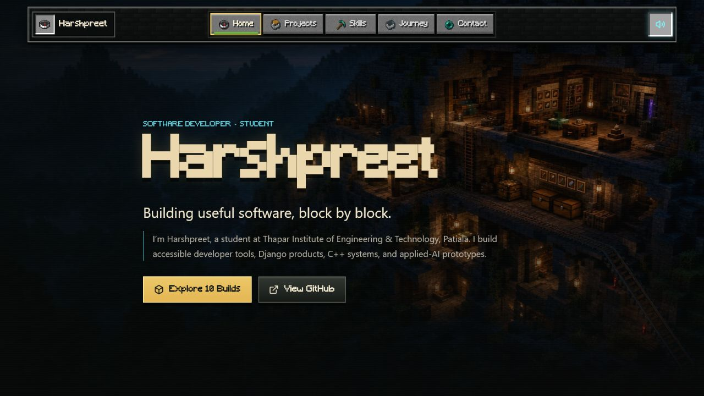
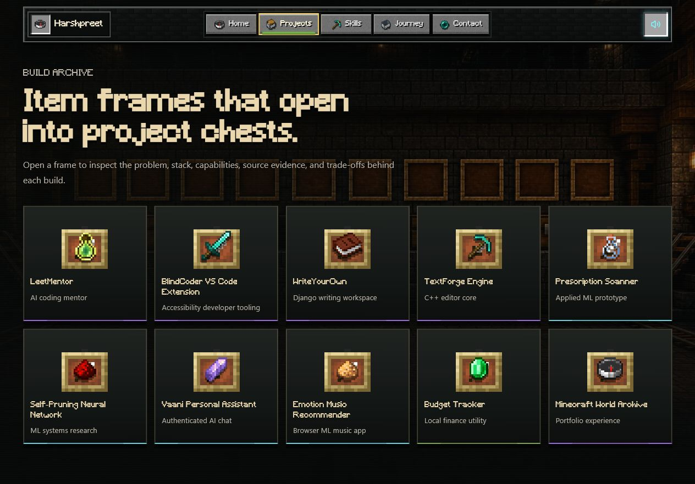
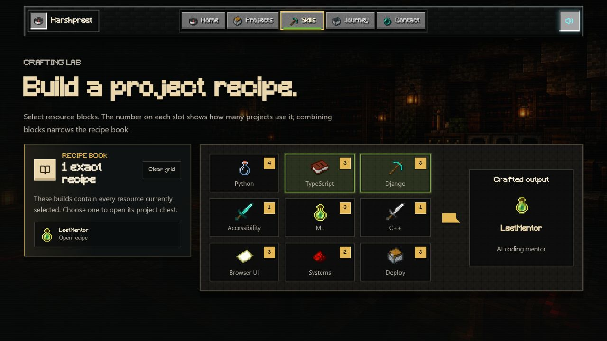
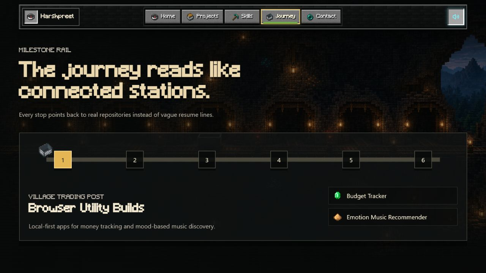
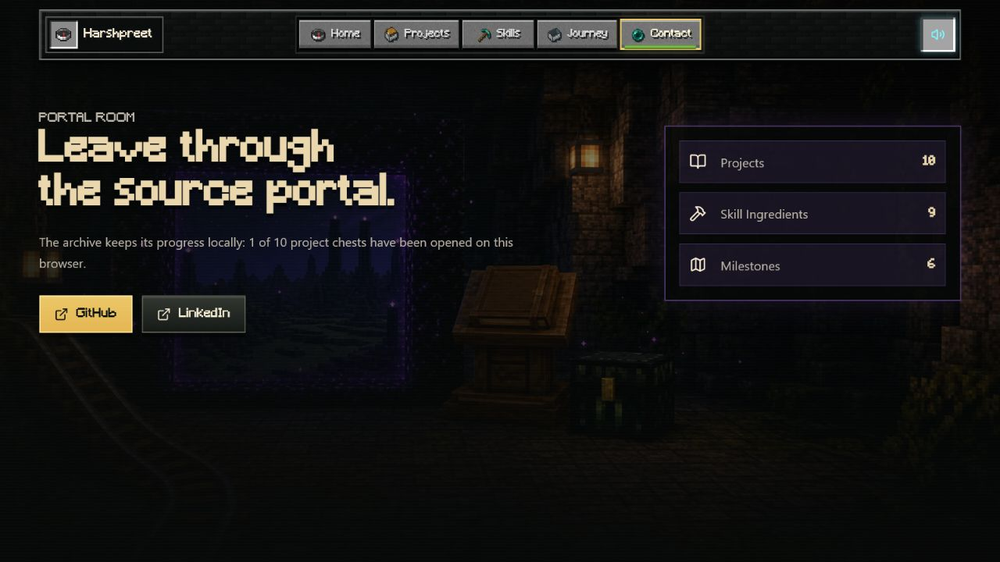

# Harshpreet — Minecraft World Archive

An interactive, Minecraft-inspired developer portfolio that turns projects, skills, and milestones into an explorable world.

### [Enter the deployed world →](https://harshpreet-minecraft-portfolio.netlify.app/)

## Aim of the project

The aim of this project is to make a technical portfolio feel memorable without hiding the engineering behind it. Instead of presenting every repository as a conventional card, the portfolio translates real development work into familiar Minecraft interactions:

- Projects become item frames that open into detailed project chests.
- Skills become crafting ingredients that can be combined into project recipes.
- Education and development milestones become stations on a minecart rail.
- GitHub and LinkedIn become destinations inside a source portal.

Every section has its own route and occupies one page at a time, while the Minecraft-style navigation bar keeps movement through the portfolio clear and predictable.

## Why I made this

I wanted a portfolio that reflects how I approach software development: building useful things one block at a time. A standard grid could list my repositories, but it could not communicate the curiosity, iteration, and problem-solving behind them.

This project gave me a way to combine storytelling with evidence. A visitor can quickly browse the world, then open a project to understand its problem, technology stack, capabilities, implementation decisions, and source code. It also allowed me to explore route-based interfaces, motion design, responsive layouts, persistent browser state, optional interface sounds, and accessible interaction patterns in one cohesive experience.

## World map

| Page | Route | Minecraft analogy | What it presents |
| --- | --- | --- | --- |
| Home | `/` | Spawn point | Introduction, profile, and entry into the portfolio |
| Projects | `/archive` | Item-frame archive and project chests | Ten repositories with their purpose, stack, evidence, and links |
| Skills | `/craft` | Crafting table and recipe book | Skills as ingredients and projects as craftable outputs |
| Journey | `/journey` | Connected minecart stations | Education and development milestones |
| Contact | `/portal` | Source portal | GitHub, LinkedIn, and a summary of the archive |

## Screenshots

### Home — Spawn Point



### Projects — Build Archive



### Skills — Crafting Lab



### Journey — Milestone Rail



### Contact — Source Portal



## Highlights

- Five route-based pages rendered one at a time
- Ten real projects backed by source and live links where available
- Interactive project chests and a filterable crafting-recipe system
- Animated page transitions and optional Minecraft-inspired interface sounds
- Locally persisted archive progress
- Keyboard-friendly controls and reduced-motion support
- Responsive presentation for desktop and mobile screens
- Netlify SPA routing for direct links to every page

## Built with

- React 18
- TypeScript
- Vite
- React Router
- Framer Motion
- Lucide React
- Custom CSS and a curated local Minecraft-style asset set

## Run locally

```bash
git clone https://github.com/Harshpreet1729/Minecraft-based-Portfolio.git
cd Minecraft-based-Portfolio
npm install
npm run dev
```

Open [http://127.0.0.1:5173](http://127.0.0.1:5173) in your browser.

## Production build

```bash
npm run build
npm run preview
```

The optimized production bundle is generated in `dist/`.

## Deployment

The portfolio is deployed on Netlify and configured through `netlify.toml` with Node.js 20, the Vite production build command, the `dist` publish directory, and an SPA fallback for direct route navigation.

**Deployed portfolio:** [https://harshpreet-minecraft-portfolio.netlify.app/](https://harshpreet-minecraft-portfolio.netlify.app/)
